# Xamarin.Forms Performance Playground

There are many techniques for increasing the **performance** of Xamarin.Forms applications. Collectively these techniques can greatly reduce the amount of work being performed by a CPU, and the amount of memory consumed by an application. This repository describes and discusses these techniques.

_(Work in progress)_

* Bindings
* CollectionView
* Fast Renderers
* HttpClient
* Images
* IoC
* Layouts
* Shell
* Startup
* Visual
* XAMLC

## Bindings

**Don't use bindings for content that can be set statically**. For example, setting Button.Text = "Accept" has less overhead than binding Button.Text to a ViewModel string property with value "Accept".

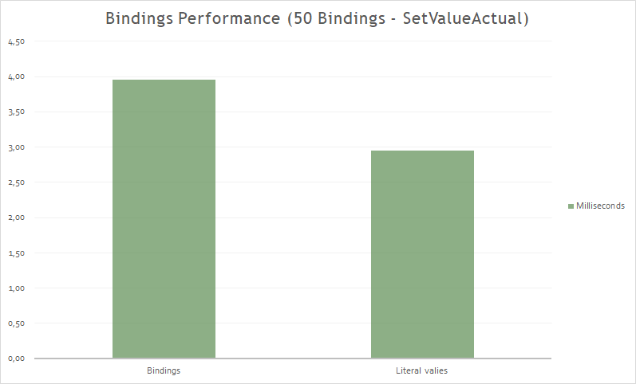

## CollectionView

And before the CollectionView arrived...

**ListView**

ListViews are often used to display much more data than can fit onscreen. 

Xamarin.Forms permits ListView cell re-use through the ListViewCachingStrategy enumeration, which has the following values:

* RetainElement. It is the default value to guarantee compatibility with previous versions of Xamarin.Forms. The ListView creates a new cell for each element in the list.
* RecycleElement.
* RecycleElementAndDataTemplate.

Other recommendations:
* In certain cases additional content is required to the ListView in the top and/or botton part. It is recommended to use the HeaderTemplate and FooterTemplate properties for this.
* Wrapping the ListView control in a ScrollView breaks virtualization!.
* It is recommended to use IList<T> as ItemsSource instead of IEnumerable.
* If RecycleElemement is used, performance is increased by removing Binding from the cell and using OnBindingContextChanged.

**CollectionView**

The CollectionView is a flexible and performant view for presenting lists of data using different layout specifications.

In addition to allowing different layouts, the CollectionView has better performance than the ListView, but... how much does it improve the performance?.

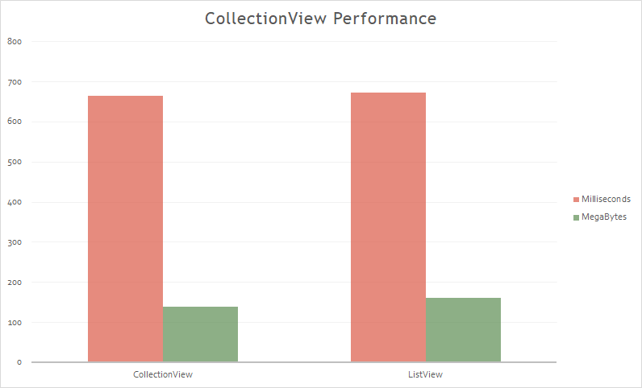

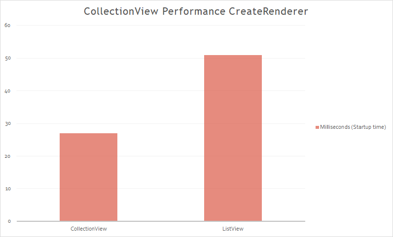

One of the biggest changes between ListView and  CollectionView is the removal of wrapping content in a  ViewCell. This allows for significant gains to performance, especially on Android, while remaining familiar to what you’ve done before when using the ListView.

While the impact on the startup time is not noticeable (is more reduced), can appreciate a noticeable difference in memory consumption.

### Fast Renderers

Traditionally, most of the original control renderers on Android are composed of two views:
* A native control, such as a Button or TextView.
* A container ViewGroup that handles some of the layout work, gesture handling, and other tasks.

However, this approach has a performance implication in that two views are created for each logical control, which results in a more complex visual tree that requires more memory, and more processing to render on screen.

Fast renderers **reduce the inflation** and rendering costs of a Xamarin.Forms control into a single view. 

Fast renderers are available for the following controls in Xamarin.Forms on Android:
* Button
* Image
* Label
* Frame

_**NOTE:** [Xamarin.Forms 4 use the Fast Renderers by Default](https://github.com/xamarin/Xamarin.Forms/issues/5724)._

The results:

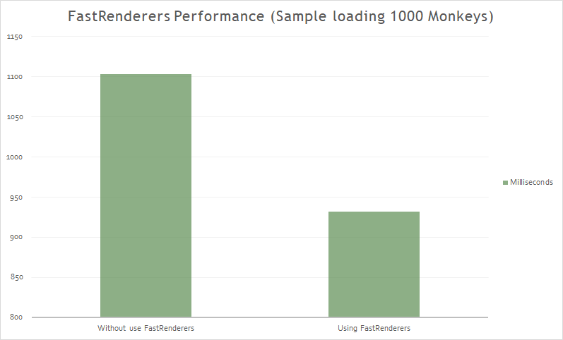

_**NOTE:** Using a Oneplus 6 device with AOT and XAMLC (Release mode)._

### HttpClient

Many mobile applications depend on external data making intensive use of the network. Therefore, we are interested in having the fastest possible response when making HTTP requests.

 Take the approach of using a single **HttpClient** instance per server (**reuse** HttpClient between requests). This will get you better performance.

The results:


This is because will segregate things each server may depend on such as cookies or DefaultRequestHeaders. 

A common mistake working with HttpClient is to download json to a string. The problem is that this creates a string of your entire JSON document needlessly. 

This has two problems:
* Depending on the size of the downloaded file to chain, it will affect more than the necessary time.
* Higher memory consumption.

Other recommendations:
- Use GZIP (or deflate) where possible.
- Use Xamarin's Native HttpMessageHandlers.

## Images 

Displaying image resources can greatly increase the app's memory footprint.
Next, we make a comparison of memory consumption between the use of images with Xamarin.Forms, with FFImageLoading and with GlideX.

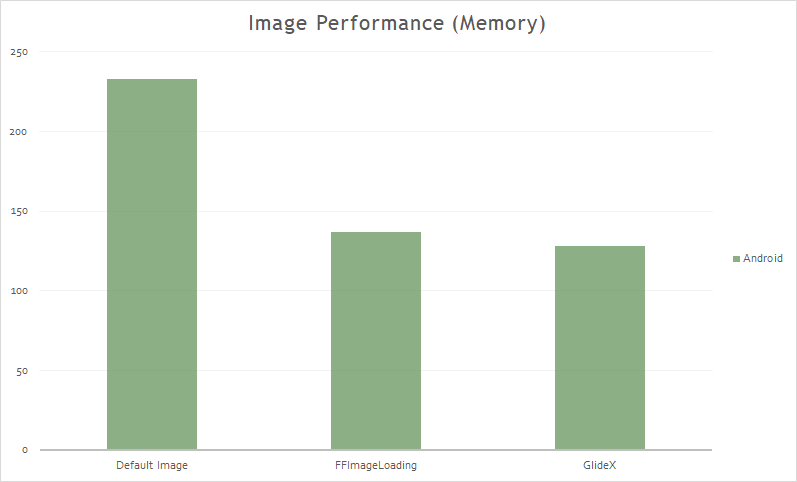

In Xamarin.Forms 4.0 there are improvements related to image management. You can find a sample and Excel with comparative data between 3.6 and 4.0. After several measurements and making averages, the image memory consumption has dropped by 15% on average.

### IoC

Comparative performance in the registry and in the dependency resolution of the most used containers when developing with Xamarin.Forms:

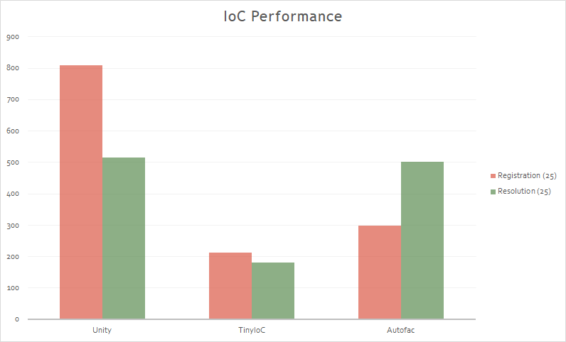

_(Work in progress)_

### Layouts

A Layout represents a node in the visual tree. A Layout has properties and events that allow to define its behavior.

It is responsible for managing the location and size of secondary nodes.

Examples: StackLayout, Grid, etc.


The creation of a Xamarin.Forms layout goes through two phases:
* **Invalidation** cycle: The process of recursive notification to the parent node.
* **Layout** cycle: After invalidating, we proceed to the reorganization of elements marked as _"invalidated"_.

The Invalidation cycle:
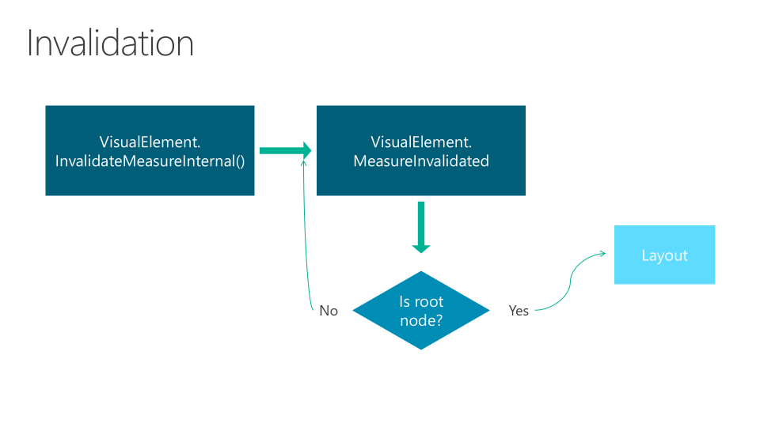

The Layout cycle:
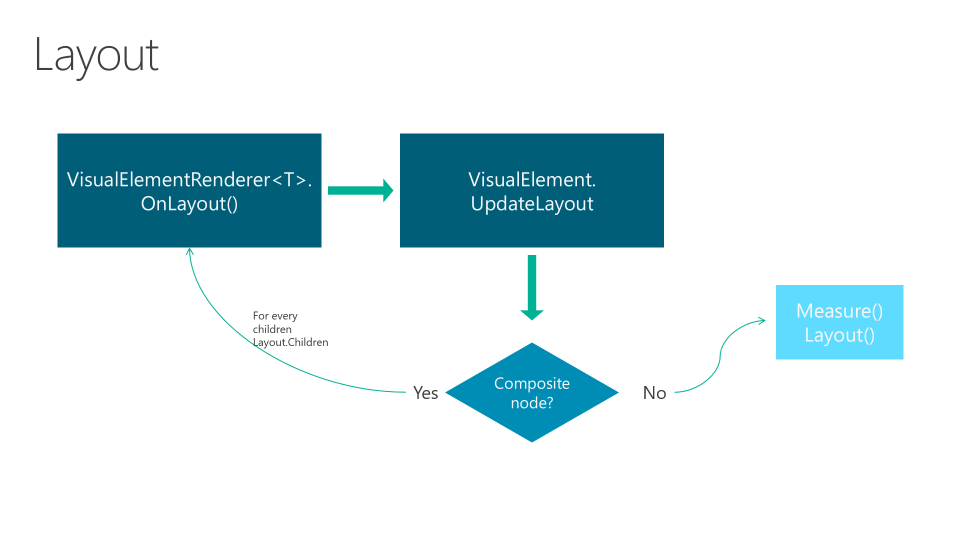

In the following chart we have the time in milliseconds of **UpdateChildrenLayout** in each Layout. The example to render:

The result:

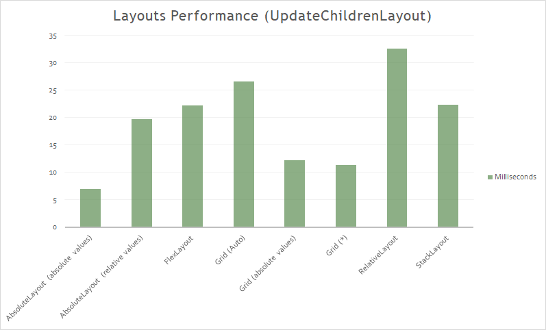

**Grid**

The Grid organizes child elements into rows and columns. It allows to create complex structures without the need for large nests.

The size of each row and column is important, and affects performance. We must take care of the use of cells and rows.

To consider:
- Using Auto in ColumnDefinition or RowDefinition, the invalidation of one of the children Views causes the chain invalidation of the visual tree of the grid.
- Using fixed values in ColumnDefinition or RowDefinition, the Grid ignores any notification of invalidation of its children.
- Using * in ColumnDefinition or RowDefinition, the Grid ignores any notification of invalidation of the children.


**StackLayout**

The StackLayout organizes views in a one-dimensional line ("stack"), either horizontally or vertically. Views in a StackLayout can be sized based on the space in the layout using layout options. Positioning is determined by the order views were added to the layout and the layout options of the views.

It can lead to **excessive nesting**.

The invalidation of a child View causes the chain invalidation in the visual tree until the StackLayout.

**RelativeLayout**

The RelativeLayout organizes the child elements based on relationships between the different elements and the container. Ideal when the size or positioning should be dynamic and adapt to different conditions.

It is the layout with lowest performance. High CPU consumption.

Other Recommendations:
* Do not use StackLayout for just one child.
* Do not use StackLayout when you can use Grid.
* Do not nest several StackLayouts when you can use a Grid.
* When using a Grid, try to ensure that as few rows and columns as possible are set to Auto size. Each auto-sized row or column will cause the layout engine to perform additional layout calculations.
* When using an AbsoluteLayout, avoid using the AbsoluteLayout.AutoSize property whenever possible.
* The RelativeLayout gives many possibilities but its performance is worse than the FlexLayout.

### Startup

JIT, AOT and other concepts have an impact on the startup time of the App.

Ahead of Time Compilation builds everything upfront, to avoid JIT when first running your app. When this option is enabled, Just In Time (JIT) startup overhead is minimized by precompiling assemblies before runtime. The resulting native code is included in the APK along with the uncompiled assemblies. This results in shorter application startup time, but at the expense of slightly larger APK sizes.

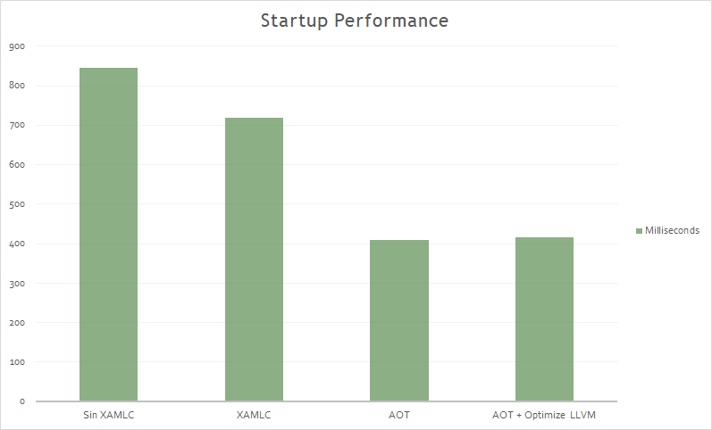

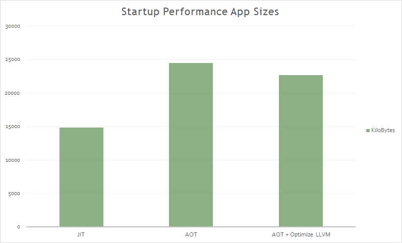

_**NOTE:** Using a Oneplus 6 device (Release mode)._

### Visual

Material Design is an opinionated design system created by Google, that prescribes the size, color, spacing, and other aspects of how views and layouts should look and behave.

Xamarin.Forms Material Visual can be used to apply Material Design rules to Xamarin.Forms applications, creating applications that look identical, or largely identical, on iOS and Android. When Material Visual is enabled, supported views adopt the same design cross-platform, creating a unified look and feel. This is achieved with material renderers, that apply the Material Design rules.

Material renderers are currently included in the [Xamarin.Forms.Visual.Material](https://www.nuget.org/packages/Xamarin.Forms.Visual.Material/) NuGet package for the following views:

* Button
* Entry
* Frame
* ProgressBar
* DatePicker
* TimePicker
* Picker
* ActivityIndicator
* Editor
* Slider
* Stepper

Functionally, the material renderers are no different to the default renderers. But ... what about the performance?.

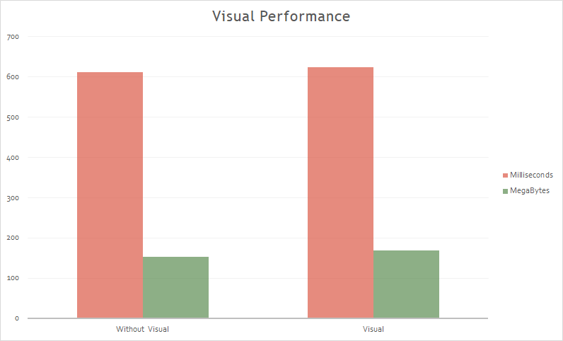

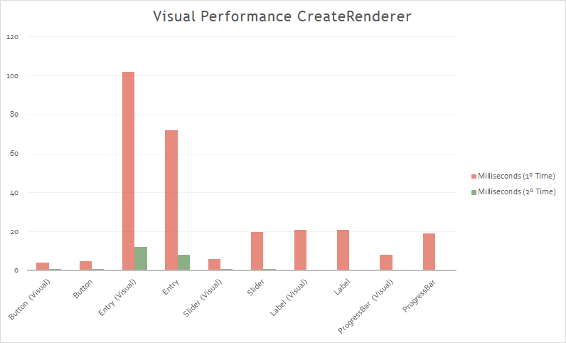
  
All current Visual renderers with Material use the **Fast Renderers** model. This makes most Material renderers faster than the default ones. In the case of the Entry, in Material have more layers, animations, etc. It is the only case that gets worse (for now).

The Visual performance tests have been made with:
- Release Mode, AOT, XAMLC (for startup times).
- Average of 5 times.
- Physical device (Oneplus 6).

### XAMLC

XAML can be optionally compiled directly into intermediate language (IL) with the XAML compiler (XAMLC).

XAML compilation offers a number of a benefits:

* It performs compile-time checking of XAML, notifying the user of any errors.
* It removes some of the load and instantiation time for XAML elements.
* It helps to reduce the file size of the final assembly by no longer including .xaml files.

```
[assembly: XamlCompilation (XamlCompilationOptions.Compile)]
```
The result:


## Copyright and license

Code released under the [MIT license](https://opensource.org/licenses/MIT).