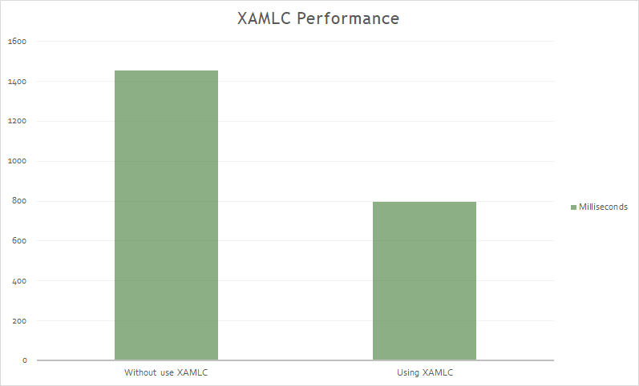
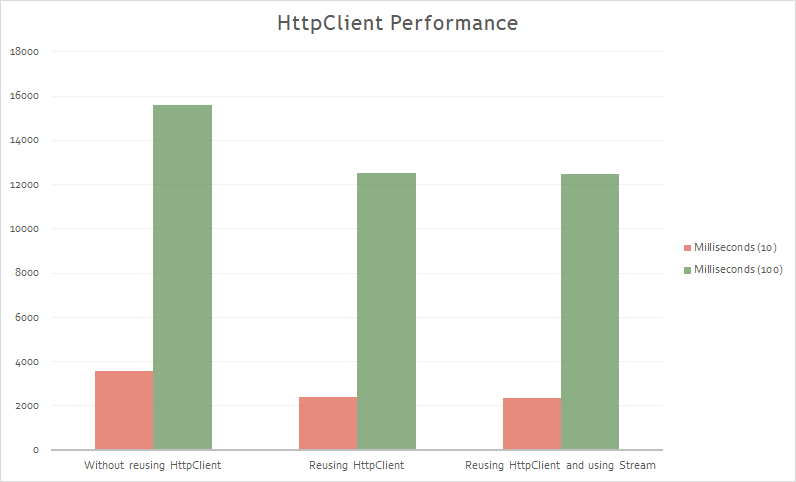

# Xamarin.Forms Performance Playground

There are many techniques for increasing the **performance** of Xamarin.Forms applications. Collectively these techniques can greatly reduce the amount of work being performed by a CPU, and the amount of memory consumed by an application. This repository describes and discusses these techniques.

_(Work in progress)_

* Bindings
* CollectionView
* Fast Renderers
* HttpClient
* Images
* IoC
* Layouts
* Shell
* Views
* Visual
* XAMLC

### XAMLC

### HttpClient

## Copyright and license

Code released under the [MIT license](https://opensource.org/licenses/MIT).